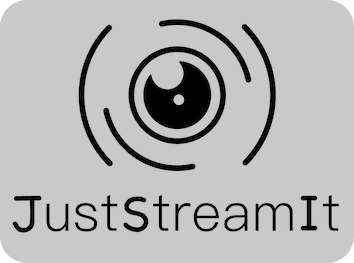

# oc_just_stream_it  

  

:books: Made for an [OpenClassrooms](https://openclassrooms.com) studies project.

`oc_just_stream_it` is a VOD platform frontend. It fetches data from a given Django REST [API](https://github.com/OpenClassrooms-Student-Center/OCMovies-API-EN-FR) and is entirely **Vanilla**.

---

<b>
:dizzy:  <a href=https://pablolec.github.io/oc_just_stream_it>Live demo</a>  :dizzy:
</b>

---

## Details

:snail: _Backend API is currently hosted on a busy Raspberry Pi which may slow down GET requests._ :snail:

The project aim was to build a landing page, in a Netflix-like fashion. Avoiding the usage of any framework was mandatory, hence creating vanilla carousels, modals, topbar, etc.  
Cross-browser compatibility should be supported and the website design is responsive across different desktop resolutions.  
This version will remain desktop only, thus usage on mobile may fail.  

## License

This project is licensed under the terms of the MIT license.
